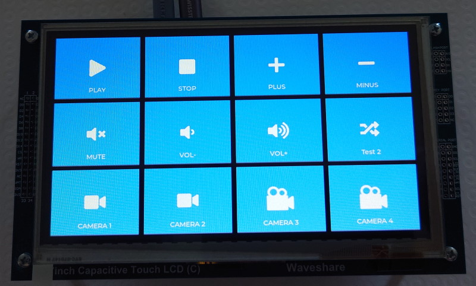

# ESP Streaming Deck

This is a very simple streaming deck with ESP32S3 dev kit and 7inch Waveshare LCD screen. Connection is via USB as a HID keyboard device. Each button simulate keyboard key or combination of the keyboard keys (maximum 6 keys in combination).



## Build

```
idf.py -p COMx flash monitor
```

## Settings

### Number of rows and cols

The first, you can select count of buttons on the screen.

```c
/* Count of the buttons */
#define APP_BUTTONS_ROWS    3
#define APP_BUTTONS_COLS    4
```
### Buttons

Buttons are defined in array.

```c
/* Definition of the buttons */
static const app_keymap_button_t app_buttons_matrix[APP_BUTTONS_ROWS][APP_BUTTONS_COLS] = {
    /* Row 1 */
    {
        /* TEXT,        IMAGE,      KEYS (max 6) */
        {"PLAY",  LV_SYMBOL_PLAY,  {HID_KEY_A}}, 
        {"STOP",  LV_SYMBOL_STOP,  {HID_KEY_B}}, 
        {"PLUS",  LV_SYMBOL_PLUS,  {HID_KEY_C}}, 
        {"MINUS", LV_SYMBOL_MINUS, {HID_KEY_D}},
    },
    /* Row 2 */
    {
        /* TEXT,        IMAGE,      KEYS (max 6) */
        {"MUTE",    APP_SYMBOL_MUTE,        {HID_KEY_1}}, 
        {"VOL-",    LV_SYMBOL_VOLUME_MID,   {HID_KEY_3}}, 
        {"VOL+",    LV_SYMBOL_VOLUME_MAX,   {HID_KEY_4}},
        {"Test 2",  LV_SYMBOL_SHUFFLE,      {HID_KEY_ALT_LEFT,HID_KEY_TAB}}, 
    },
    /* Row 3 */
    {
        /* TEXT,        IMAGE,      KEYS (max 6) */
        {"CAMERA 1", APP_SYMBOL_VIDEO, {HID_KEY_ALT_LEFT,HID_KEY_CONTROL_LEFT,HID_KEY_1}}, 
        {"CAMERA 2", APP_SYMBOL_VIDEO, {HID_KEY_ALT_LEFT,HID_KEY_CONTROL_LEFT,HID_KEY_2}}, 
        {"CAMERA 3", &img_camera,      {HID_KEY_ALT_LEFT,HID_KEY_CONTROL_LEFT,HID_KEY_3}}, 
        {"CAMERA 4", &img_camera,      {HID_KEY_ALT_LEFT,HID_KEY_CONTROL_LEFT,HID_KEY_4}}
    },
};
```

### Images

Image can be a symbol from [FontAwesome](https://fontawesome.com/v5/search) or converted image by [LVGL](https://lvgl.io/tools/imageconverter).

**FontAwesome symbol definition**

When you find the symbol on the FontAwesome website, take the hexadecimal code, convert it from Unicode to UTF-8 and define like this:

```c
#define APP_SYMBOL_VIDEO   "\xEF\x80\xBD" /* Unicode: 61501, 0xf03d; UTF-8: 0xEF 0x80 0xBD */ 
```

LVGL built-is symbols:


Some symbols defined in main:
* APP_SYMBOL_REC          
* APP_SYMBOL_MUTE         
* APP_SYMBOL_VIDEO        
* APP_SYMBOL_VIDEO_SLASH 
* APP_SYMBOL_TV          
* APP_SYMBOL_MIC         
* APP_SYMBOL_MIC_SLASH   
* APP_SYMBOL_MIC1        
* APP_SYMBOL_MIC1_SLASH  
* APP_SYMBOL_HEADPHONES  
* APP_SYMBOL_HEADPHONES1 
* APP_SYMBOL_YOUTUBE     

Note: You can convert the Unicode to UTF-8 [here](https://www.utf8-chartable.de/unicode-utf8-table.pl?start=61501&number=1).

**Own image definition**

When you convert image via LVGL converter, copy image into [main/images/](main/images/) folder. After thath, define image in code by this:

```c
LV_IMG_DECLARE(img_camera)
```

After that, you can put `&img_camera` into button defition.